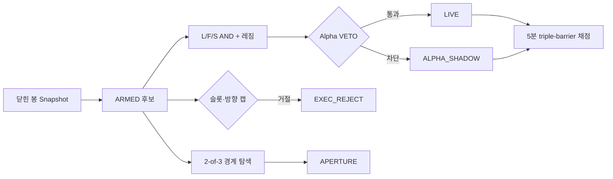

# ORTHO-4 — 비용 0 가상매매 스캘핑 신호 봇

> **현재 모드:** `ORTHO-4.SIM0` · 15분 의사결정 · 비용 0 가상채점 · **실주문 없음**
>
> 이 저장소는 OKX 선물 시장의 다중 시간대 신호를 Notion에 기록하고, 이후 triple-barrier 방식으로 가상 성과를 채점합니다. 수익을 보장하지 않으며, `SIM_COST_0` 결과는 실체결 수익성과 다릅니다.

## 1. 무엇을 하는가

ORTHO는 점수를 합산하는 전략이 아니라 **세 개의 직교 축이 동시에 동의하는가**를 확인하는 15분봉 스캘핑 신호 엔진입니다. 레짐 라우터가 해당 시장 상태에서 평가할 폴라리티를 한 개로 제한하고, 구조 기반 TP/SL과 R 단위 위험을 부여합니다. 모든 결과는 Notion 원장에 남고, VETO로 제외된 후보는 Shadow 원장에서 반사실 성과를 비교할 수 있습니다.

| 시간대 | 역할 | 핵심 산출물 |
|---|---|---|
| 15분 | 위치·진입 구조·TP/SL | `L_pct`, ATR, 구조 배리어 |
| 5분 | 단기 흐름 확인 | `F_pct`, candle momentum |
| 1시간·4시간 | 방향 구조·레짐 문맥 | `S_state`, `MacroTag`, 레짐 |

기본 감시 심볼은 `BTC/USDT`, `ETH/USDT`, `HYPE/USDT`, `SOL/USDT`, `SUI/USDT`, `XRP/USDT`입니다.

---

## 2. ORTHO-4.SIM0의 운영 계약

V4는 진입 아이디어를 새로 발명한 패치가 아니라, **시간 정렬·비용 가정·상태 원장·반사실 검증**을 명시적으로 고정한 가상캠페인입니다.

| 항목 | ORTHO-4의 고정 규칙 |
|---|---|
| 시간 정렬 | `CLOSED_CANDLES=true`를 강제합니다. 15분·5분·1시간·4시간의 형성 중 봉은 신호 계산에서 제외합니다. |
| 비용 가정 | `Cost Mode=SIM_COST_0`, `Estimated Cost R=0`, `Realized Cost R=0`입니다. |
| 성과 장부 | 비용 0이므로 `Gross R=Net R`, `Net RR=RR`입니다. 두 값은 Note 문자열이 아니라 전용 Notion 숫자 필드에 기록됩니다. |
| BE | 비용 0 기준선에서는 본전 이동을 비활성화합니다. 결과는 고정 TP/SL/시간 배리어로 채점됩니다. |
| 체결 | 실주문·실제 fill·수수료·슬리피지 모델은 구현하지 않았습니다. 현재 행은 가상 신호입니다. |
| 배포 | 저장소의 워크플로는 현재 `workflow_dispatch` 수동 실행만 설정되어 있습니다. 반복 실행을 새로 활성화하지 않습니다. |

> **중요:** 이 캠페인은 “비용이 0일 때 L/F/S·레짐·VETO 철학 자체가 유의미한가”를 검증합니다. 실제 비용을 넣는 날에는 `REAL_COST`와 별도 `Strategy ID`를 사용하고, 두 캠페인의 성과를 합산하지 않아야 합니다.

---

## 3. 핵심 신호 알고리즘

### 3.1 L/F/S 직교 축

| 축 | 계산 | 진입에서의 역할 |
|---|---|---|
| **L — 위치** | 15분 종가의 SMA 대비 ATR 정규화 편차를 최근 자기분포 백분위로 변환 | REV의 극단, CONT의 눌림, BREAKOUT의 VWAP 문맥을 구분 |
| **F — 흐름** | 5분 candle momentum의 최근 자기분포 백분위 | 거래 방향과 단기 압력이 같은지 확인 |
| **S — 구조** | 15분·1시간·4시간 EMA 정렬 및 구조 붕괴 | 상위 시간대 문맥과 반대되는 신호를 배제 |

세 축은 가산 점수가 아니라 **AND 조건**입니다. 즉, 하나의 보조 지표가 매우 강하더라도 필수 축이 불충족이면 본선 신호가 되지 않습니다. 구현은 [`src/ortho_engine.py`](src/ortho_engine.py)에 있습니다.

### 3.2 레짐 라우터와 폴라리티

| 레짐 | 허용 폴라리티 | 아이디어 | 구조 목표 |
|---|---|---|---|
| `RANGE` | `REV` | L 극단에서 F 반전이 확인된 평균회귀 | 15분 SMA |
| `TREND` | `CONT` | 다중 시간대 구조와 같은 방향의 눌림 재개 | 직전 스윙 |
| `EXPANSION` | `BREAKOUT` | 변동성 확장·VWAP/거래량·F 확인 | 직전 스윙 |

레짐은 Kaufman ER과 정규화 변동성의 조합으로 판단합니다. 라우터가 켜져 있으면 한 레짐에서 하나의 폴라리티만 본선 평가합니다. `SOFT` 모드나 새로운 진입 토글은 이 기준선의 결과를 본 뒤 별도 캠페인에서만 검증해야 합니다.

### 3.3 구조 기반 배리어와 R

손절은 최근 스윙에 ATR 버퍼를 더하거나 빼서 정하고, 목표가는 폴라리티의 구조적 목표에서 계산합니다. 명목 RR이 `RR_MIN`에 미달하면 신호를 만들지 않으며, `RR_MAX`와 `T_MAX`가 결과 범위를 제한합니다.

```text
SIM_COST_0 수량 = RISK_PER_TRADE / |Entry - SL|
실현 Gross R   = 방향별 (Exit - Entry) / |Entry - SL|
실현 Net R     = Gross R
```

동일 5분 봉에서 TP와 SL이 함께 닿으면 채점기는 보수적으로 `LOSS`를 우선합니다. 시간 한도 도달 시에는 해당 시점 종가로 승패와 R을 판정합니다.[`src/ortho_resolver.py`](src/ortho_resolver.py)

---

## 4. V4에서 VETO가 작동하는 방식

V4는 VETO를 **알파 가설**과 **운영/포트폴리오 제약**으로 분리합니다. 이 구분이 없으면 “VETO가 나쁜 신호를 제거했는가”와 “그 시점에 단지 운영상 기록하지 못했는가”를 혼동하게 됩니다.

| 구분 | `Veto Class` | 예시 | 원장 단계 | 비교 목적 |
|---|---|---|---|---|
| 본선 통과 | `NONE` | 모든 L/F/S·VETO 통과 | `LIVE` | 기준 성과 |
| Alpha VETO | `ALPHA` | `MACRO_FRESH`, `FLOW_FLOOR`, `CROWD`, `TAKER` | `ALPHA_SHADOW` | 같은 구조 배리어에서 본선 대비 반사실 성과 비교 |
| 운영 거절 | `EXECUTION` | `SLOT`, `DIRCAP` 및 향후 실행 제약 | `EXEC_REJECT` | 운영 기회비용·집중 위험 기록; Alpha 성과 비교에서 제외 |
| 경계 연구 | `APERTURE` | `EXPLORE:DROP_L/F/S` | `APERTURE` | 다음 사전등록 가설의 후보 생성 |

### 비용 0 가정과 스프레드

V4 기준선에서는 **스프레드가 신호를 차단하지 않습니다.** `SPREAD_MAX_BPS` 기반 거부권은 V3 호환 경로에서만 적용됩니다. 이는 비용을 무시한 이상화된 성과를 의도적으로 분리하기 위한 결정이며, 실체결 성과의 증거가 아닙니다.

---

## 5. V4 신호 수명주기와 Notion 원장



엔진 내부에서는 후보가 먼저 `ARMED` snapshot으로 만들어집니다. 원장에 실제로 적재하는 시점에만 최종 단계가 부여됩니다. 각 신규 행에는 다음 계보 정보가 기록됩니다.

| 속성 | 역할 |
|---|---|
| `Decision ID` | 동일 시점·심볼·폴라리티·방향·entry를 식별하는 결정 ID |
| `Strategy ID` | 현재 기준선은 `ORTHO-4.SIM0` |
| `Git SHA`, `Workflow Run ID` | 어떤 코드·실행에서 생성되었는지 추적 |
| `Config Hash` | 진입 집합을 정의한 설정의 hash |
| `Snapshot At`, `Market Snapshot Hash` | 닫힌 봉 기반 의사결정과 시장 문맥을 재현 |
| `V4 Stage`, `Veto Class`, `Veto Reason V4` | 본선·Shadow·운영 거절·경계 연구의 구분 |
| `Gross R`, `Net R`, `Net RR` | 비용 0 가상 성과의 전용 장부 |

Notion 기록이 실패하면 해당 후보는 알림과 OPEN 인덱스에 반영하지 않습니다. 즉, 원장 없는 신호를 정상 운영 신호로 취급하지 않습니다.[`src/ortho_main.py`](src/ortho_main.py)

---

## 6. 주요 파라미터

### 진입 집합을 정의하는 핵심 파라미터

| 변수 | 기본값 | 역할 |
|---|---:|---|
| `ORTHO_W_L` | 72 | L 위치축 자기분포 윈도우(15분) |
| `ORTHO_P_EXT` | 10 | REV 극단 백분위 컷 |
| `ORTHO_N_MEAN` | 20 | SMA 기간 및 REV 목표 기준 |
| `ORTHO_W_F` | 6 | F 흐름 측정 창(5분) |
| `ORTHO_P_FLOW` | 30 | 흐름 동조 백분위 컷 |
| `ORTHO_LS_CROWD_VETO` | 0.85 | 군중 과밀 Alpha VETO 기준 |
| `ORTHO_TAKER_VETO` | 0.65 | taker 역방향 Alpha VETO 기준 |
| `ORTHO_SL_ATR_BUF` | 0.25 | 구조 손절의 ATR 버퍼 |
| `ORTHO_RR_MIN` | 1.0 | 구조 RR 최소값 |
| `ORTHO_T_MAX` | 8 | 보유 한도(15분 봉 수, 기본 2시간) |
| `ORTHO_MAX_POS_DIR` | 2 | 심볼·방향별 OPEN 한도 |
| `ORTHO_MAX_CONCURRENT_DIR` | 3 | 전 심볼 동일방향 OPEN 한도 |

`ORTHO_SPREAD_MAX_BPS`는 V4 비용 0 본선에서는 신호를 차단하지 않습니다. `ORTHO_BE_TRIGGER_R`, `ORTHO_BE_LOCK_R`도 V4에서 0으로 고정됩니다.

### V4 고정 식별자

| 변수 | 기본값 | 설명 |
|---|---|---|
| `ORTHO_V4_ENABLED` | `true` | 닫힌 봉·비용 0·V4 원장을 강제 |
| `ORTHO_STRATEGY_ID` | `ORTHO-4.SIM0` | 캠페인 구분자 |
| `GITHUB_SHA` | 자동 주입 | 코드 리비전 계보 |
| `GITHUB_RUN_ID` | 자동 주입 | 실행 계보 |

---

## 7. 파일 구조

```text
src/
├── ortho_config.py    # V4 기본값, 진입·리스크 설정
├── ortho_data.py      # OKX 캔들·맥락 데이터 수집
├── ortho_engine.py    # L/F/S, 레짐, VETO, 구조 배리어, ARMED 후보
├── ortho_v4.py        # V4 상태·계보·비용 0 순 R 계약
├── ortho_notion.py    # Notion 스키마·기록·결과 업데이트
├── ortho_main.py      # 후보 수집·VETO/슬롯 승인·원장 기록
├── ortho_resolver.py  # 5분 triple-barrier 채점
├── ortho_notify.py    # 선택적 텔레그램 알림
└── timeutil.py        # KST 시각 처리

scripts/
├── create_shadow_db.py  # V4 속성을 포함한 Shadow DB 생성
├── ortho_report.py      # Notion CSV 기반 성과·코호트 리포트
└── ortho_sweep.py       # 오프라인 탐색 보조

tests/
└── test_ortho_v4.py     # V4 상태·비용 0·Notion 원장 회귀 테스트
```

---

## 8. 로컬 검증

```bash
python3 -m py_compile src/*.py scripts/create_shadow_db.py
python3 -m unittest discover -s tests -v
```

V4 회귀 테스트는 다음을 확인합니다.

1. Alpha VETO·운영 거절·경계 탐색의 단계 분리가 올바른지 확인합니다.
2. 비용 0에서 `Gross R=Net R`이 유지되는지 확인합니다.
3. 비용 0 본선에서 스프레드가 신호를 차단하지 않는지 확인합니다.
4. Notion 기록·결과 업데이트 payload가 V4 전용 필드를 포함하는지 확인합니다.

---

## 9. 운영 순서

1. Notion 주 DB와 Shadow DB에 봇 통합 연결 권한을 부여합니다.
2. `NOTION_TOKEN`, `NOTION_DATABASE_ID`, `NOTION_SHADOW_DB_ID`를 Secret으로 설정합니다.
3. `ALERT_ENABLED=false`에서 가상 신호와 Shadow 원장을 먼저 축적합니다.
4. Actions에서 신호 생성과 채점 작업을 수동 실행해 V4 속성·결과 기록을 점검합니다.
5. Notion CSV를 내보내 `scripts/ortho_report.py`로 LIVE와 Shadow를 **분리** 분석합니다.
6. 새 VETO 또는 파라미터를 추가하기 전에는 단 하나의 가설만 사전등록하고, 새 `Strategy ID`와 `Config Hash`로 다음 캠페인을 시작합니다.

## 10. 현재 한계

- `SIM_COST_0`은 수수료·스프레드·슬리피지·부분 체결·펀딩을 모두 0으로 둡니다.
- Shadow 비교는 거부권의 유용성을 측정하기 위한 장치이지, 실체결 가능성을 증명하지 않습니다.
- 레짐·방향·심볼별 세부 성과는 표본 독립성과 다중검정을 고려해 해석해야 합니다.
- 수동 실행 워크플로는 반복 운영을 보장하지 않습니다. 반복 또는 실시간 운영을 새로 도입하기 전에는 별도 운영 설계와 검증이 필요합니다.

## References

[1]: [신호 엔진과 VETO 구현](src/ortho_engine.py)
[2]: [V4 상태·계보·비용 0 계약](src/ortho_v4.py)
[3]: [Notion 원장과 결과 기록](src/ortho_notion.py)
[4]: [Triple-barrier 채점기](src/ortho_resolver.py)
[5]: [V4 단위 테스트](tests/test_ortho_v4.py)

**작성 기준:** 2026-08-15 KST · 커밋 `07be882` 이후 코드 기준.

**면책:** This is research and analysis only, not personalized financial advice.
